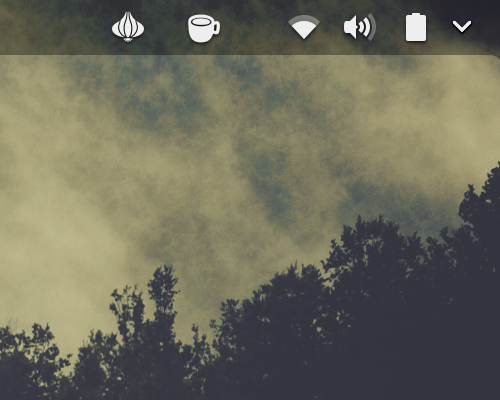

# TorShell
Easy and convenient way to anonymize your web traffic in your linux box. (Gnome Shell Extension)

## USAGE
 


## PREREQUISITES
### Install TOR service
In Ubuntu/Debian:
```
sudo apt-get install tor
```
Fedora/RPM:
```
sudo dnf install tor
```
Arch:

```
pacman -S tor
```

If you don't have wget and unzip install it before running the installation script.

## INSTALATION

As regular user run:

```
curl https://raw.githubusercontent.com/SIISCAD/TorShell/master/install.sh | bash
```

You may have to reload Gnome-Shell in order to appy the changes.

